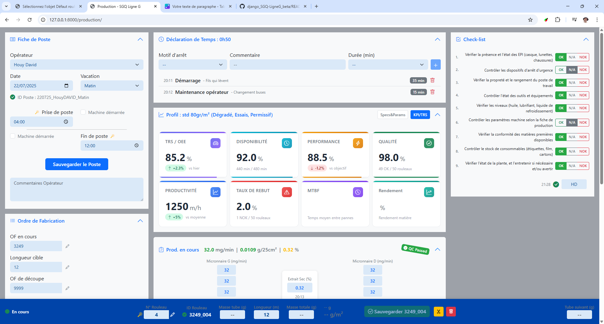
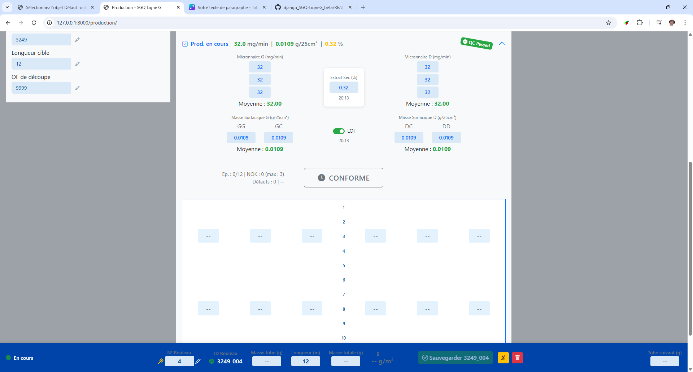

# SGQ Ligne G - Système de Gestion Qualité Production

## 🎯 Objectif

Le SGQ Ligne G est un système de pilotage de production en temps réel pour l'industrie de la fibre optique. Il garantit la traçabilité complète, le contrôle qualité et l'optimisation de la performance selon les normes ISO 9001, 14001 et 45001.

## 📊 Bénéfices Métier

### Pour la Production
- **Zéro perte de données** : Sauvegarde automatique continue
- **Pilotage temps réel** : TRS et indicateurs de performance instantanés
- **Traçabilité totale** : Chaque rouleau est tracé de A à Z
- **Détection précoce** : Alertes immédiates sur les dérives qualité
- **Longueur cible flexible** : De 1m à illimité, adaptation automatique de l'interface

### Pour la Qualité
- **Conformité garantie** : Validation automatique selon les spécifications produit
- **Contrôles adaptatifs** : Mesures d'épaisseur à 1m (si <3m) ou tous les 5m à partir de 3m
- **Historique complet** : Analyse des tendances et causes racines
- **Certification facilitée** : Données structurées pour les audits ISO

### Pour le Management
- **Tableaux de bord en direct** : Suivi de la performance par vacation
- **Analyse des temps perdus** : Identification des gisements d'amélioration
- **ROI mesurable** : Réduction des rebuts et optimisation du rendement
- **Reporting automatisé** : Exports pour analyses et présentations

## 📸 Aperçu de l'Interface

*Interface principale avec contrôle qualité, zone rouleau et indicateurs temps réel*

*Zone rouleau avec validation des épaisseurs et détection des défauts*

## 🚀 Fonctionnalités Clés

### 1. Gestion des Postes
- Identification automatique : `220725_MartinDUPONT_Matin`
- Checklist de démarrage obligatoire
- Signature électronique intégrée
- Calcul automatique du temps de travail

### 2. Suivi des Rouleaux
- Création avec ID unique automatique
- Mesures d'épaisseur en temps réel
- Détection et catégorisation des défauts
- Décision automatique : Conforme / Non-conforme

### 3. Contrôle Qualité Intelligent
- **Validation instantanée** : Vert = OK, Orange = Alerte, Rouge = NOK
- **Défauts catégorisés** :
  - 🔴 Bloquants : Arrêt production immédiat
  - 🟠 Non-bloquants : Production continue avec suivi
  - ⚠️ Avec seuil : Bloquant après X occurrences
- **Rattrapage des NOK** : Système de correction intégré

### 4. Performance WCM (World Class Manufacturing)
- Déclaration simplifiée des temps perdus
- Catégories prédéfinies (Démarrage, Panne, Changement OF...)
- Calcul automatique du TRS
- Objectifs et écarts visualisés

### 5. Interface Intuitive et Ergonomique
- **Guidage intelligent** : L'opérateur est accompagné pas à pas tout au long du processus
- **Navigation fluide** : Enchaînement logique des écrans suivant le flux de production
- **Codes couleur universels** : Vert/Orange/Rouge pour une compréhension immédiate
- **Ergonomie étudiée** : Zones cliquables larges, contrastes optimisés, lisibilité maximale
- **Validation progressive** : Impossible de passer à l'étape suivante sans compléter la précédente
- **Retours visuels immédiats** : Chaque action est confirmée visuellement
- **Mobilité** : Interface responsive adaptée tablette pour les rondes terrain

## 💡 Cas d'Usage Concrets

### Début de Vacation
1. L'opérateur s'identifie → ID poste généré automatiquement
2. Checklist de démarrage → Validation obligatoire avant production
3. État machine vérifié → Continuité avec la vacation précédente

### Production en Cours
1. Mesures d'épaisseur → Validation immédiate OK/NOK
2. Défaut détecté → Catégorisation et décision conforme/non-conforme
3. Temps perdu → Déclaration en 2 clics avec motif

### Fin de Vacation
1. Bilan automatique → Rouleaux produits, TRS, temps perdus
2. Sauvegarde du poste → Toutes les données consolidées
3. Transmission → Vacation suivante informée de l'état machine

## 🛡️ Sécurité et Fiabilité

- **Sauvegarde continue** : Aucune perte même en cas de coupure
- **Validation métier** : Règles de gestion intégrées
- **Audit trail** : Historique complet des modifications
- **Droits d'accès** : Par rôle (Opérateur, Superviseur, Qualité)

## 🔧 Prérequis Techniques

- **Navigateur moderne** : Chrome, Firefox ou Edge (dernières versions)
- **Connexion réseau** : Accès au serveur local
- **Résolution minimale** : 1024x768 (optimal : 1920x1080)
- **Formation** : 2h pour les opérateurs, 4h pour les superviseurs

## 📞 Support

Pour toute question ou demande d'évolution :
- **Production** : Contacter le responsable de ligne
- **Qualité** : Service qualité central
- **Technique** : DSI / Support informatique

---

*SGQ Ligne G - La qualité sous contrôle, la performance en temps réel*